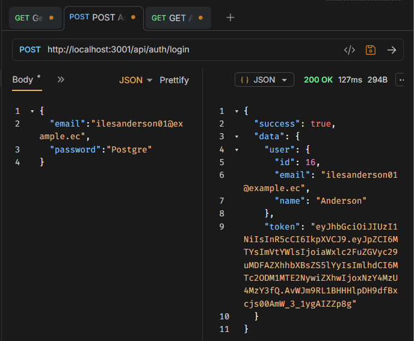
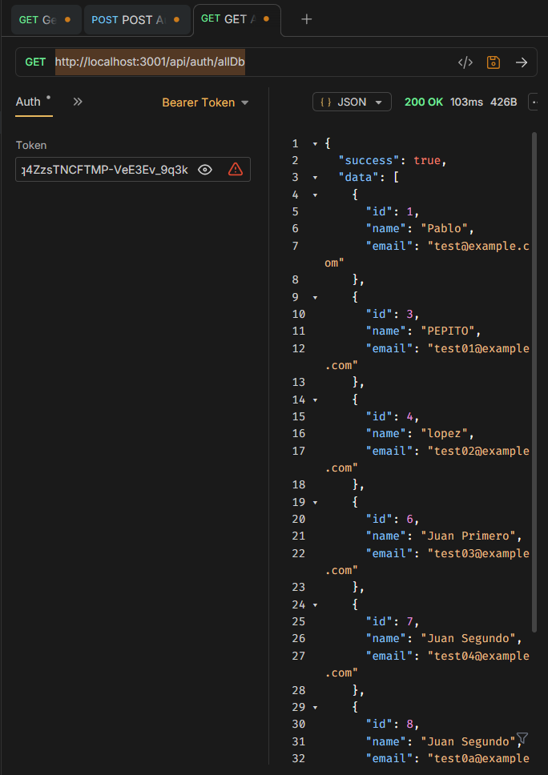
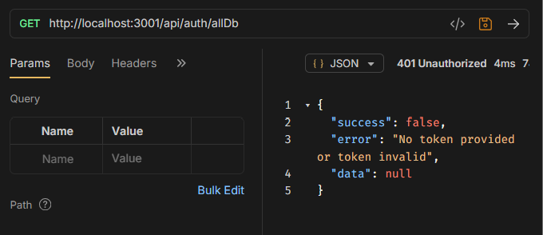

# auth_api
Sistema de autenticación con JWT usando Node.js, Express y PostgreSQL.

## Features

- Registro de usuarios
- Login con JWT
- Password hashing con bcrypt
- Validación de inputs

## Tech Stack

- Node.js + Express
- PostgreSQL
- JWT para autenticación
- Bcrypt para hashing

## Setup

1. Instalar dependencias:
```powershell
pnpm i express dotenv express-validator jsonwebtoken nodemon pg bcryptjs
```

2. Configurar `.env`:
```
DATABASE_URL=postgresql://...
JWT_SECRET=your-secret
```

3. Crear base de datos:
```sql
CREATE DATABASE auth_db;
CREATE TABLE users (
  id SERIAL PRIMARY KEY,
  email VARCHAR(255) UNIQUE NOT NULL,
  password VARCHAR(255) NOT NULL,
  name VARCHAR(50) NOT NULL,
  created_at TIMESTAMP DEFAULT NOW(),
  updated_at TIMESTAMP DEFAULT NOW()
);
```

4. Correr servidor:
```powershell 
pnpm dev
```

## Endpoints

### POST /api/auth/register
Registra nuevo usuario.

**Request:**
```json
{
  "email": "user@example.com",
  "password": "password123",
  "name": "John Doe"
}
```

**Response 201:**
```json
{
  "success": true,
  "data": {
    "user": { ... },
    "token": "..."
  }
}
```

### POST /api/auth/login
Login usuario existente.

**Request:**
```json
{
  "email": "user@example.com",
  "password": "password123",
}
```

**Response 200:**
```json
{
  "success": true,
  "data": {
    "user": { ... },
    "token": "..."
  }
}
```
## Features
- Obtención de tokens
- Validación de tokens Bearers

## Endpoints
### POST /api/auth/allDb
Obtener todos los usuarios.

**Response 200:**
```json
{
  "success": true,
  "data": [
    //get id, name and email of all Users
  ]
}
```
Para obtener los tokens en la APP Bruno, se debe logear un las credenciales correspondientes, una vez obtenido un OK, se obtendra el token también. La copiamos y luego cuando se necesite hacer un GET a /api/auth/allDb se debe incluir el token en el apartado Auth.

## Ejemplos
### Obtener el token generado por cada login
Realizando un POST con los credenciales correspondientes registrados en la base de datos.
#### Obteniendo:

### Obtener todos los usuarios con token
Realizando un GET a http://localhost:3001/api/auth/allDb
#### Obteniendo:


### Obtener todos los usuarios sin token
GET a http://localhost:3001/api/auth/allDb
#### Obteniendo:


## Deployment

### Environment Variables Required

- `PORT` - Puerto del servidor
- `DATABASE_URL` - PostgreSQL connection string
- `NODE_ENV` - "production" para producción

### Deploy to RailWay

1. Conectar repositorio GitHub
2. Crear PostgreSQL database
3. Crear Web Service
4. Configurar variables de entorno
5. Deploy automático

## Live Demo

🚀 **Production URL:** https://authapi-production-8843.up.railway.app/

### Endpoints

- POST /api/auth/register - Register user
- POST /api/auth/login - Login user
- GET /api/auth/allDb - Get current all users (protected)

### Bruno Tests
Para hacer los mismo tests realizado en bruno, se puede importar el archivo docs/Test Auth_api Desployed.json a Bruno

## Endpoints

### Authentication
#### POST /api/auth/login
Login existing user.

**Response:**
```json
{
  "success": true,
  "data": {
    "user": { ... },
  },
  "token":"access token"
}
```
El refresh token es enviado al navegador que lo almacenará en las cookies.
#### POST /api/auth/refresh
Obtener access token usando el refresh token

**Request:**
El navegador automaticamente adjunta todas las cookies validas en la cabecera de cada petición hacia el servidor. 
El servidor la recibe en texto plano y desordenado, donde utiliza el middleware cookieParser() para procesarlo e inyectarlo en el objeto req.cookies.
```string
  "refresh-token"
```

**Response:**
```json
{
    "accessToken": "new-access-token"
}
```

#### GET /api/auth/allDb
Obtener información de todos los usuarios (Protegido).

**Headers:**
```
Authorization: Bearer access-token
```

#### PUT /api/auth/change-password
Cambiar contraseña de usuario (Protegido).

**Headers:**
```
Authorization: Bearer access-token
```

**Request:**
```json
{
  "currentPass": "old-password",
  "newPass": "new-password",
  "confirmPass":"same-new-password"
}
```