# auth_api
Sistema de autenticación con roles, refresh token y gestión de contraseñas usando Node.js, Express y PostgreSQL.

## Features

- Registro de usuarios con validación de gmail
- Login con JWT, access token y refresh token
- Gestión de constraseñas usando hashing con bcrypt
- Validación de inputs
- Gestión de roles para usuarios (user|admin)
- Protección de rutas

## Tech Stack

- Node.js + Express
- PostgreSQL
- JWT para autenticación
- Bcrypt para hashing
- express-validator
## Setup

1. Instalar dependencias:
```powershell
pnpm i express dotenv express-validator jsonwebtoken nodemon pg bcryptjs
```

2. Configurar `.env`:
```
DATABASE_URL=postgresql://...
JWT_SECRET=your-secret
JWT_SECRET_REFRESH=your-secret-refresh
JWT_EXPIRES_IN:1m
JWT_EXPIRES_REFRESH_IN:3m
NODE_ENV:production
```

3. Crear base de datos:
Usuarios:
```sql
CREATE TABLE users (
  id SERIAL PRIMARY KEY,
  email VARCHAR(255) UNIQUE NOT NULL,
  password VARCHAR(255) NOT NULL,
  name VARCHAR(50) NOT NULL,
  created_at TIMESTAMP DEFAULT NOW(),
  updated_at TIMESTAMP DEFAULT NOW(),
  role VARCHAR(15) DEFAULT 'user'
);
```
refresh_token:
```sql
CREATE DATABASE refresh_token (
  id SERIAL PRIMARY KEY,
  id_user INT,
  token TEXT,
  expires_at TIMESTAMP DEFAULT LOCALTIMESTAMP,
  isrevoked BOOLEAN DEFAULT false,
  CONSTRAINT id_refreshtoken_fk FOREIGN KEY (id_user) REFERENCES users(id) ON DELETE CASCADE
)
```

4. Correr servidor:
```powershell 
pnpm dev
```

## Endpoints

### POST /api/auth/register
Registra nuevo usuario.

**Request:**
```json
{
  "email": "user@example.com",
  "password": "password123",
  "name": "John Doe"
}
```

**Response 201:**
```json
{
  "success": true,
  "data": {
    "user": { ... },
    "token": "..."
  }
}
```
#### Ejemplo:
##### Registrar usuario
Realizando un POST con datos validos 
POST a https://authapi-production-8843.up.railway.app/api/auth/register
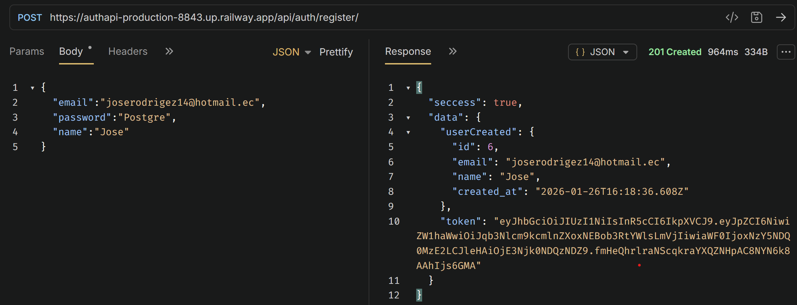

Realizando un POST con datos invalidos 
POST a https://authapi-production-8843.up.railway.app/api/auth/register
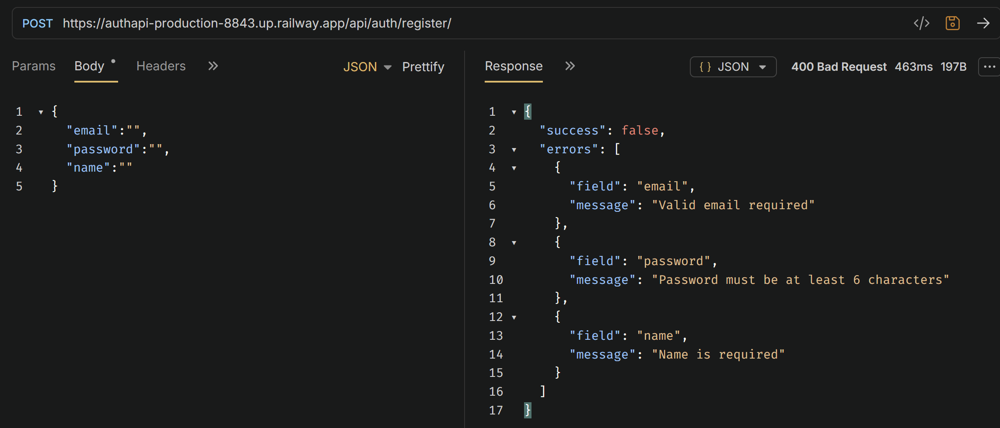

### POST /api/auth/login
Login usuario existente.

**Request:**
```json
{
  "email": "user@example.com",
  "password": "password123",
}
```

**Response 200:**
```json
{
  "success": true,
  "data": {
    "user": { ... },
    "token": "..."
  }
}
```
El refresh token es enviado al navegador que lo almacenará en las cookies.
#### Ejemplo:
##### Realizar login y obtener un token access
Realizando un POST con las credenciales correspondientes registrados en la base de datos.
POST a https://authapi-production-8843.up.railway.app/api/auth/login
###### Obteniendo:
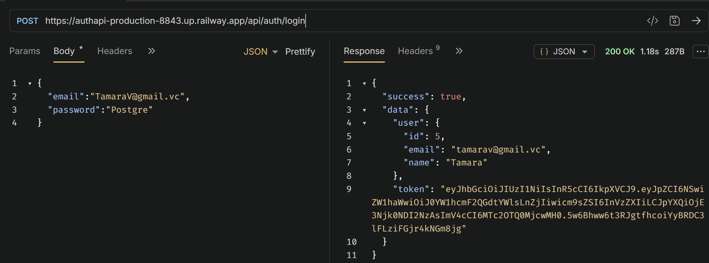

### POST /api/auth/allDb
Obtener todos los usuarios. Pero solo lo pueden hacer aquellos usuarios con rol admin

**Headers:**
```
Authorization: Bearer access-token
```
**Response 200:**
```json
{
  "success": true,
  "data": [
    //get id, name and email of all Users
  ]
}
```
Para obtener los tokens en la APP Bruno, se debe logear con las credenciales correspondientes, una vez obtenido un OK, se obtendra el token también. La copiamos y luego cuando se hacer GET a /api/auth/allDb se debe incluir el token en el apartado Auth y ser admin.

#### Ejemplos:
##### Obtener todos los usuarios con token y rol admin
Realizando un GET a https://authapi-production-8843.up.railway.app/api/auth/allDb
###### Obteniendo:
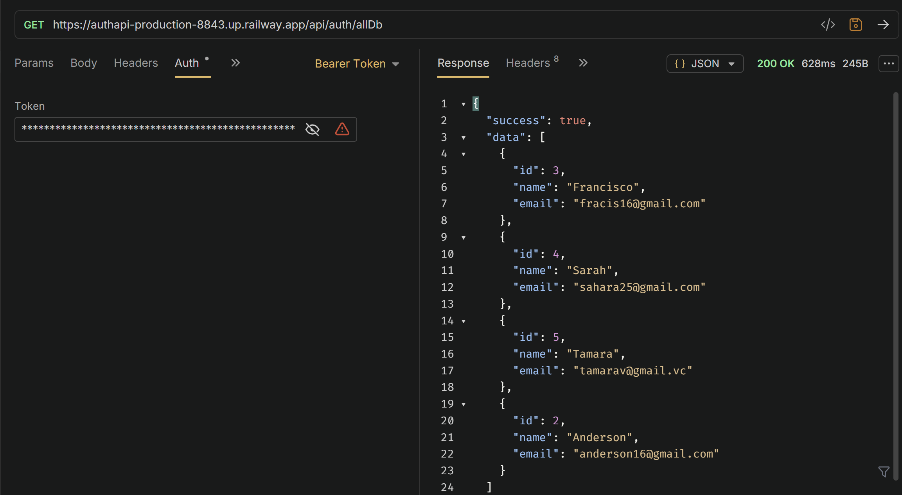

##### Obtener todos los usuarios sin token
GET a https://authapi-production-8843.up.railway.app/api/auth/allDb
###### Obteniendo:
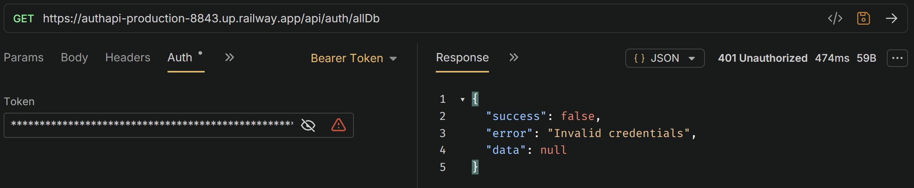

##### Obtener todos los usuarios sin rol admin
GET a https://authapi-production-8843.up.railway.app/api/auth/allDb
###### Obteniendo:
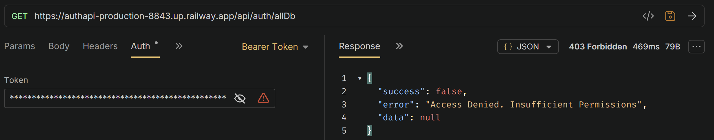

### PATCH /api/auth/change-password
Cambiar contraseña del usuario, enviando la constraseña actual, nueva contraseña y confirmación de contraseña con datos validos del usuario logeado.
**Headers:**
```
Authorization: Bearer access-token
```
**Request:**
```json
{
  "currentPass": "old-password",
  "newPass": "new-password",
  "confirmPass":"same-new-password"
}
```

**Response 200**
```json
{
  "succes":true,
  "message":"La Contraseña ha sido actualizada correctamente"
}
```
#### Ejemplos:
##### Cambio de contraseña exitosamente
###### Obteniendo:
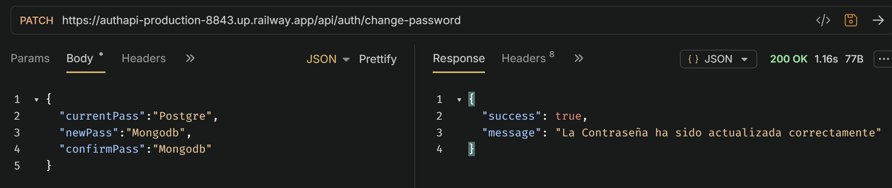
##### Cambio de contraseña con token invalido.
PATCH a https://authapi-production-8843.up.railway.app/api/auth/change-password
###### Obteniendo:
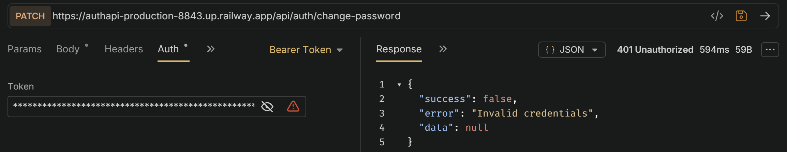

##### Cambio de contraseña con datos invalidos.
PATCH a https://authapi-production-8843.up.railway.app/api/auth/change-password
###### Obteniendo:
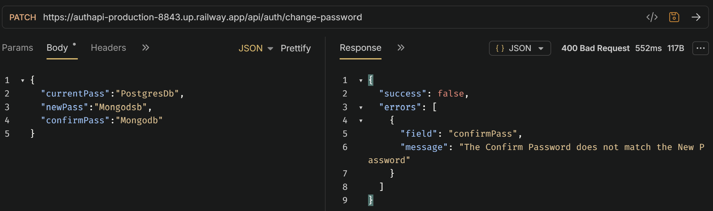
or
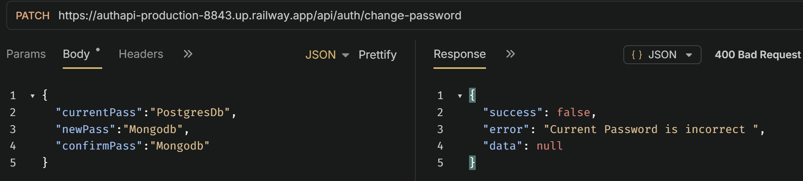


### POST /api/auth/refresh-token
Obtener access token usando el refresh token

**Request:**
El navegador automaticamente adjunta todas las cookies validas en la cabecera de cada petición hacia el servidor. 
El servidor la recibe en texto plano y desordenado, donde utiliza el middleware cookieParser() para procesarlo e inyectarlo en el objeto req.cookies.
```string
  "refresh-token"
```

**Response 200:**
```json
{
    "accessToken": "new-access-token"
}
```
#### Ejemplo:
##### Obtener el access token generado en el endpoint /refresh_token
POST a https://authapi-production-8843.up.railway.app/api/auth/refresh-token
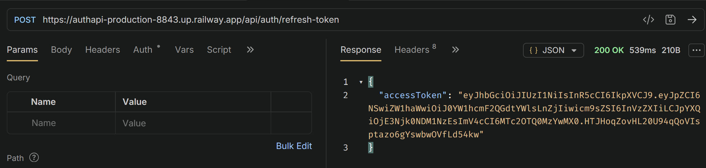

##### Obtener el access token generado en el endpoint /refresh_token cuando haya expirado el token refresh
POST a https://authapi-production-8843.up.railway.app/api/auth/refresh-token
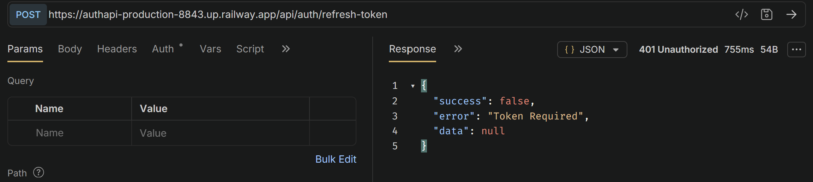


## Flujo de Autenticación

1. El registro/login exitoso permite obtener un access token que es valido por 30s y un refresh token valido por 7 días
2. Usamos el access token para rutas protegidas como /change-password o /allDb
3. Cuando el access token caduca se usa el refresh token para obtener una nueva.

## Deployment

### Environment Variables Required

- `PORT` - Puerto del servidor
- `DATABASE_URL` - PostgreSQL connection string
- `NODE_ENV` - "production" para producción

### Deploy to RailWay

1. Conectar repositorio GitHub
2. Crear PostgreSQL database
3. Crear Web Service
4. Configurar variables de entorno
5. Deploy automático

## Live Demo

🚀 **Production URL:** https://authapi-production-8843.up.railway.app/

### Endpoints

- POST /api/auth/register - Registrar usuario
- POST /api/auth/login - Login del usuario
- GET /api/auth/allDb - Obtener todos los usuarios para los usuarios con rol admin (ruta protegida)
- PATCH /api/auth/change-password - Cambiar la contraseña (ruta protegida)
- POST /api/auth/refresh-token - Permite obtener un nuevo token para cuando expire el access token, hasta que expire el refresh token

### Bruno Tests
Para hacer los mismo tests realizado en bruno, se puede importar el archivo 'docs/Test Auth_api Desployed.json' a Bruno

## Roles

- **user**: Este rol se establece por defecto
- **admin**: Puede acceder a los datos de todos los usuarios de la base de datos

##  Project Structure
```
src/
├── config/
│   └── database.js
├── constants/
│   ├── httpStatusCode.js
│   ├── statusMessages.js
│   ├── validations.js
├── controllers/
│   └── authController.js
├── helpers/
|   └── parseTime.js
├── middleware/
│   ├── auth.js
│   ├── checkRole.js
│   ├── validation.js
│   └── errorHandler.js
├── routes/
│   └── authRoutes.js
└── server.js
```